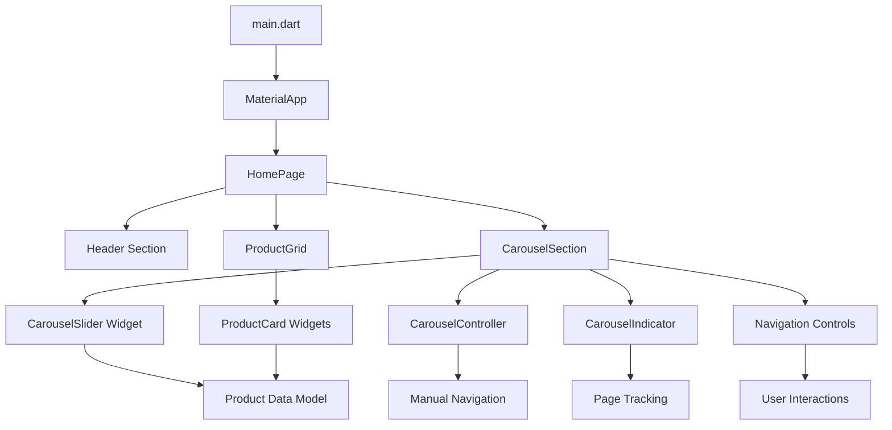
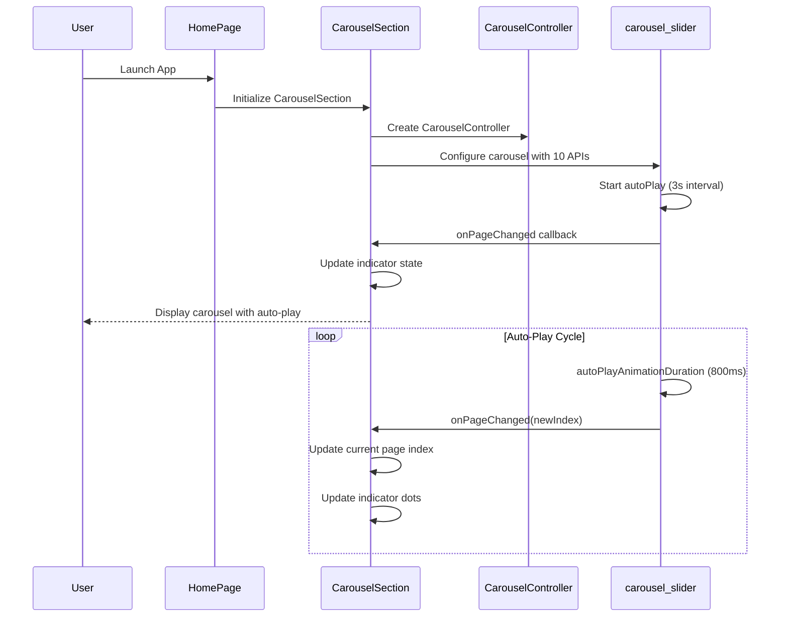
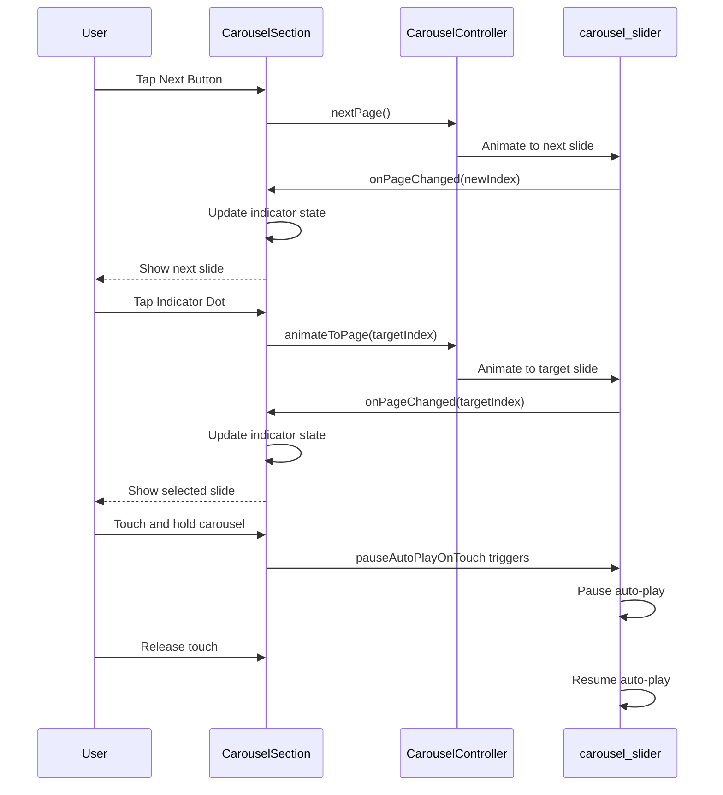

# Design Document: Laviade Store Flutter App

## Overview

The Laviade Store Flutter app is a comprehensive mini e-commerce application showcasing streetwear fashion with a minimalist, modern design aesthetic. The app features a single home screen with sophisticated carousel functionality using all 10 carousel_slider APIs, demonstrating advanced Flutter widget composition and state management. The design emphasizes clean architecture, modular components, and meaningful implementation of carousel features within a realistic e-commerce context.

The application serves as both a functional e-commerce interface and a technical demonstration of carousel_slider capabilities, with each API serving a specific UX purpose in the overall shopping experience. The streetwear formal theme creates a premium, professional appearance using a carefully curated black, white, and grey color palette.

## Architecture

The application follows a layered architecture with clear separation of concerns, emphasizing widget composition and state management best practices.



## Sequence Diagrams

### Carousel Initialization and Auto-Play Flow



### Manual Navigation Flow



## Components and Interfaces

### Component 1: HomePage

**Purpose**: Main container widget that orchestrates the entire home screen layout

**Interface**:
```dart
class HomePage extends StatelessWidget {
  const HomePage({Key? key}) : super(key: key);
  
  @override
  Widget build(BuildContext context) => Scaffold;
}
```

**Responsibilities**:
- Provide main scaffold structure with black background
- Coordinate header, carousel, and product grid sections
- Maintain consistent theme throughout the app
- Handle overall page layout and spacing

### Component 2: CarouselSection

**Purpose**: Advanced carousel widget implementing all 10 carousel_slider APIs with sophisticated UX patterns

**Interface**:
```dart
class CarouselSection extends StatefulWidget {
  const CarouselSection({Key? key}) : super(key: key);
  
  @override
  State<CarouselSection> createState() => _CarouselSectionState();
}

class _CarouselSectionState extends State<CarouselSection> {
  late CarouselController _carouselController;
  int _currentIndex = 0;
  
  // API Configuration Methods
  void _configureCarouselAPIs();
  void _handlePageChanged(int index);
  void _navigateToPage(int index);
  void _nextPage();
  void _previousPage();
}
```

**Responsibilities**:
- Implement all 10 carousel_slider APIs with meaningful configurations
- Manage carousel state and page tracking
- Provide manual navigation controls (next/previous buttons)
- Display interactive indicator dots
- Handle touch interactions and auto-play pause/resume
- Coordinate with product data model

### Component 3: ProductCard

**Purpose**: Reusable card component for displaying individual product information

**Interface**:
```dart
class ProductCard extends StatelessWidget {
  final String productName;
  final String price;
  final Color placeholderColor;
  
  const ProductCard({
    Key? key,
    required this.productName,
    required this.price,
    required this.placeholderColor,
  }) : super(key: key);
  
  @override
  Widget build(BuildContext context) => Container;
}
```

**Responsibilities**:
- Display product placeholder image with themed colors
- Show product name and price with consistent typography
- Maintain streetwear formal aesthetic
- Provide consistent spacing and layout

### Component 4: CarouselIndicator

**Purpose**: Custom indicator widget showing current carousel position

**Interface**:
```dart
class CarouselIndicator extends StatelessWidget {
  final int currentIndex;
  final int itemCount;
  final Function(int) onTap;
  
  const CarouselIndicator({
    Key? key,
    required this.currentIndex,
    required this.itemCount,
    required this.onTap,
  }) : super(key: key);
  
  @override
  Widget build(BuildContext context) => Row;
}
```

**Responsibilities**:
- Display dot indicators for each carousel item
- Highlight active page with visual distinction
- Handle tap interactions for direct navigation
- Provide smooth visual feedback during transitions

## Data Models

### Model 1: ProductModel

```dart
class ProductModel {
  final String id;
  final String name;
  final String price;
  final Color placeholderColor;
  final String category;
  
  const ProductModel({
    required this.id,
    required this.name,
    required this.price,
    required this.placeholderColor,
    required this.category,
  });
  
  // Factory constructor for creating from Map
  factory ProductModel.fromMap(Map<String, dynamic> map) => ProductModel(
    id: map['id'] ?? '',
    name: map['name'] ?? '',
    price: map['price'] ?? '',
    placeholderColor: map['color'] ?? Colors.grey,
    category: map['category'] ?? 'streetwear',
  );
}
```

**Validation Rules**:
- ID must be non-empty string
- Name must be non-empty string with max 50 characters
- Price must follow "Rp XXX.XXX" format
- PlaceholderColor must be from approved theme palette
- Category must be valid streetwear category

### Model 2: CarouselConfiguration

```dart
class CarouselConfiguration {
  final bool autoPlay;
  final Duration autoPlayInterval;
  final Duration autoPlayAnimationDuration;
  final bool enlargeCenterPage;
  final double viewportFraction;
  final bool enableInfiniteScroll;
  final Axis scrollDirection;
  final bool pauseAutoPlayOnTouch;
  
  const CarouselConfiguration({
    this.autoPlay = true,
    this.autoPlayInterval = const Duration(seconds: 3),
    this.autoPlayAnimationDuration = const Duration(milliseconds: 800),
    this.enlargeCenterPage = true,
    this.viewportFraction = 0.8,
    this.enableInfiniteScroll = true,
    this.scrollDirection = Axis.horizontal,
    this.pauseAutoPlayOnTouch = true,
  });
}
```

**Validation Rules**:
- autoPlayInterval must be between 1-10 seconds
- autoPlayAnimationDuration must be between 200-2000 milliseconds
- viewportFraction must be between 0.1-1.0
- scrollDirection must be Axis.horizontal or Axis.vertical

## Algorithmic Pseudocode

### Main Carousel Initialization Algorithm

```pascal
ALGORITHM initializeCarousel()
INPUT: carouselConfiguration of type CarouselConfiguration
OUTPUT: configuredCarousel of type CarouselSlider

BEGIN
  ASSERT carouselConfiguration ≠ null
  
  // Step 1: Initialize controller
  controller ← CarouselController()
  
  // Step 2: Configure all 10 APIs
  carouselOptions ← CarouselOptions(
    autoPlay: carouselConfiguration.autoPlay,
    autoPlayInterval: carouselConfiguration.autoPlayInterval,
    autoPlayAnimationDuration: carouselConfiguration.autoPlayAnimationDuration,
    enlargeCenterPage: carouselConfiguration.enlargeCenterPage,
    viewportFraction: carouselConfiguration.viewportFraction,
    enableInfiniteScroll: carouselConfiguration.enableInfiniteScroll,
    scrollDirection: carouselConfiguration.scrollDirection,
    pauseAutoPlayOnTouch: carouselConfiguration.pauseAutoPlayOnTouch,
    onPageChanged: handlePageChanged
  )
  
  // Step 3: Create carousel with product items
  configuredCarousel ← CarouselSlider.builder(
    carouselController: controller,
    options: carouselOptions,
    itemCount: productList.length,
    itemBuilder: buildCarouselItem
  )
  
  ASSERT configuredCarousel.isInitialized()
  
  RETURN configuredCarousel
END
```

**Preconditions**:
- carouselConfiguration is validated and well-formed
- productList contains at least 1 item
- All required carousel_slider dependencies are available

**Postconditions**:
- Returns fully configured CarouselSlider widget
- All 10 APIs are properly configured with meaningful values
- Carousel is ready for display and interaction

**Loop Invariants**: N/A (no loops in initialization)

### Page Change Handling Algorithm

```pascal
ALGORITHM handlePageChanged(newIndex)
INPUT: newIndex of type integer
OUTPUT: updatedState of type CarouselState

BEGIN
  ASSERT newIndex ≥ 0 AND newIndex < productList.length
  
  // Step 1: Validate index bounds
  IF newIndex < 0 OR newIndex ≥ productList.length THEN
    RETURN currentState
  END IF
  
  // Step 2: Update current index
  previousIndex ← currentIndex
  currentIndex ← newIndex
  
  // Step 3: Trigger indicator update
  indicatorState ← updateIndicatorState(currentIndex)
  
  // Step 4: Log page change for analytics (optional)
  logPageChange(previousIndex, currentIndex)
  
  // Step 5: Update widget state
  setState(() => {
    _currentIndex = currentIndex,
    _indicatorState = indicatorState
  })
  
  ASSERT currentIndex = newIndex
  ASSERT indicatorState.activeIndex = newIndex
  
  RETURN updatedState
END
```

**Preconditions**:
- newIndex is within valid range [0, productList.length)
- Carousel widget is mounted and initialized
- setState function is available

**Postconditions**:
- currentIndex is updated to newIndex
- Indicator state reflects the new active page
- Widget is rebuilt with updated state

**Loop Invariants**: N/A (no loops in page change handling)

### Manual Navigation Algorithm

```pascal
ALGORITHM navigateToPage(targetIndex, animationDuration)
INPUT: targetIndex of type integer, animationDuration of type Duration
OUTPUT: navigationResult of type boolean

BEGIN
  ASSERT targetIndex ≥ 0 AND targetIndex < productList.length
  ASSERT animationDuration > Duration.zero
  
  // Step 1: Validate target index
  IF targetIndex < 0 OR targetIndex ≥ productList.length THEN
    RETURN false
  END IF
  
  // Step 2: Check if already at target
  IF currentIndex = targetIndex THEN
    RETURN true
  END IF
  
  // Step 3: Pause auto-play during manual navigation
  IF autoPlayEnabled THEN
    pauseAutoPlay()
  END IF
  
  // Step 4: Animate to target page
  TRY
    carouselController.animateToPage(
      targetIndex,
      duration: animationDuration,
      curve: Curves.easeInOut
    )
    
    // Step 5: Resume auto-play after animation
    scheduleAutoPlayResume(animationDuration + Duration(milliseconds: 500))
    
    RETURN true
    
  CATCH NavigationException
    RETURN false
  END TRY
END
```

**Preconditions**:
- targetIndex is within valid bounds
- carouselController is initialized and ready
- animationDuration is positive value

**Postconditions**:
- Carousel animates to target page if successful
- Auto-play is temporarily paused and then resumed
- Returns true if navigation successful, false otherwise

**Loop Invariants**: N/A (no loops in navigation)

## Key Functions with Formal Specifications

### Function 1: buildCarouselItem()

```dart
Widget buildCarouselItem(BuildContext context, int index, int realIndex)
```

**Preconditions:**
- `context` is valid BuildContext
- `index` is within bounds [0, productList.length)
- `realIndex` is the actual index in infinite scroll context
- `productList[index]` contains valid ProductModel

**Postconditions:**
- Returns valid Widget representing carousel item
- Widget displays product information correctly
- Widget follows streetwear formal theme guidelines
- Widget is properly sized for carousel viewport

**Loop Invariants:** N/A (function doesn't contain loops)

### Function 2: configureCarouselAPIs()

```dart
CarouselOptions configureCarouselAPIs()
```

**Preconditions:**
- All carousel_slider dependencies are available
- CarouselConfiguration contains valid values
- onPageChanged callback is defined

**Postconditions:**
- Returns CarouselOptions with all 10 APIs configured
- Each API serves a meaningful UX purpose
- Configuration values are within valid ranges
- All callbacks are properly wired

**Loop Invariants:** N/A (configuration is declarative)

### Function 3: updateIndicatorState()

```dart
void updateIndicatorState(int activeIndex)
```

**Preconditions:**
- `activeIndex` is within valid range [0, itemCount)
- Indicator widget is mounted and ready for updates
- State management system is available

**Postconditions:**
- Indicator dots reflect current active page
- Visual distinction between active and inactive dots
- Smooth transition animation between states
- No visual glitches or inconsistencies

**Loop Invariants:**
- For indicator update loops: All processed indicators maintain consistent styling

## Example Usage

### Basic Carousel Implementation

```dart
// Example 1: Complete carousel setup with all 10 APIs
class CarouselSection extends StatefulWidget {
  @override
  State<CarouselSection> createState() => _CarouselSectionState();
}

class _CarouselSectionState extends State<CarouselSection> {
  late CarouselController _carouselController;
  int _currentIndex = 0;
  
  @override
  void initState() {
    super.initState();
    _carouselController = CarouselController();
  }
  
  @override
  Widget build(BuildContext context) {
    return Column(
      children: [
        // Main carousel with all 10 APIs configured
        CarouselSlider.builder(
          carouselController: _carouselController, // API 4: CarouselController
          options: CarouselOptions(
            autoPlay: true,                        // API 1: autoPlay
            autoPlayInterval: Duration(seconds: 3), // API 7: autoPlayInterval
            autoPlayAnimationDuration: Duration(milliseconds: 800), // API 8: autoPlayAnimationDuration
            enlargeCenterPage: true,               // API 2: enlargeCenterPage
            viewportFraction: 0.8,                // API 5: viewportFraction
            enableInfiniteScroll: true,           // API 6: enableInfiniteScroll
            scrollDirection: Axis.horizontal,     // API 9: scrollDirection
            pauseAutoPlayOnTouch: true,          // API 10: pauseAutoPlayOnTouch
            onPageChanged: (index, reason) {     // API 3: onPageChanged
              setState(() => _currentIndex = index);
            },
          ),
          itemCount: productList.length,
          itemBuilder: (context, index, realIndex) => buildCarouselItem(index),
        ),
        
        // Navigation controls
        Row(
          mainAxisAlignment: MainAxisAlignment.spaceEvenly,
          children: [
            IconButton(
              onPressed: () => _carouselController.previousPage(),
              icon: Icon(Icons.arrow_back, color: Colors.white),
            ),
            CarouselIndicator(
              currentIndex: _currentIndex,
              itemCount: productList.length,
              onTap: (index) => _carouselController.animateToPage(index),
            ),
            IconButton(
              onPressed: () => _carouselController.nextPage(),
              icon: Icon(Icons.arrow_forward, color: Colors.white),
            ),
          ],
        ),
      ],
    );
  }
}
```

### Advanced API Configuration

```dart
// Example 2: Detailed API configuration with UX rationale
CarouselOptions _buildCarouselOptions() {
  return CarouselOptions(
    // Core auto-play configuration for engaging UX
    autoPlay: true,                              // Keeps users engaged
    autoPlayInterval: Duration(seconds: 3),      // Optimal viewing time per product
    autoPlayAnimationDuration: Duration(milliseconds: 800), // Smooth, premium feel
    
    // Visual enhancement for focus and hierarchy
    enlargeCenterPage: true,                     // Draws attention to featured product
    viewportFraction: 0.8,                      // Shows adjacent items for context
    
    // Navigation and interaction
    enableInfiniteScroll: true,                 // Seamless browsing experience
    scrollDirection: Axis.horizontal,           // Standard e-commerce pattern
    pauseAutoPlayOnTouch: true,                // Respects user interaction
    
    // State management
    onPageChanged: (index, reason) {
      _handlePageChanged(index, reason);
      _trackCarouselAnalytics(index, reason);
    },
  );
}
```

### Complete Widget Integration

```dart
// Example 3: Full home page with carousel integration
class HomePage extends StatelessWidget {
  @override
  Widget build(BuildContext context) {
    return Scaffold(
      backgroundColor: Colors.black,
      body: SafeArea(
        child: SingleChildScrollView(
          padding: EdgeInsets.all(16),
          child: Column(
            crossAxisAlignment: CrossAxisAlignment.start,
            children: [
              // Header section
              _buildHeader(),
              SizedBox(height: 32),
              
              // Featured carousel with all 10 APIs
              CarouselSection(),
              SizedBox(height: 32),
              
              // Product grid
              _buildProductGrid(),
            ],
          ),
        ),
      ),
    );
  }
}
```

## Correctness Properties

The following properties ensure the carousel implementation maintains correctness and provides optimal user experience:

### Property 1: Carousel State Consistency
```dart
// Universal quantification: For all carousel state changes
∀ (pageChange: PageChangeEvent) →
  (0 ≤ newIndex < productList.length) ∧
  (indicatorState.activeIndex = newIndex) ∧
  (carouselController.currentPage = newIndex)
```

### Property 2: Auto-Play Timing Invariant
```dart
// Auto-play maintains consistent intervals
∀ (autoPlayCycle: AutoPlayEvent) →
  (timeBetweenSlides ≥ autoPlayInterval - tolerance) ∧
  (timeBetweenSlides ≤ autoPlayInterval + tolerance) ∧
  (tolerance = 100ms)
```

### Property 3: Manual Navigation Precedence
```dart
// Manual navigation always takes precedence over auto-play
∀ (userInteraction: ManualNavigationEvent) →
  (autoPlayPaused = true) ∧
  (navigationCompletes → autoPlayResumes) ∧
  (resumeDelay ≥ 500ms)
```

### Property 4: Viewport Fraction Consistency
```dart
// Viewport fraction maintains visual hierarchy
∀ (carouselItem: CarouselItemWidget) →
  (centerItem.scale > adjacentItem.scale) ∧
  (visibleItemCount = floor(1 / viewportFraction) + 1) ∧
  (0.1 ≤ viewportFraction ≤ 1.0)
```

### Property 5: Infinite Scroll Continuity
```dart
// Infinite scroll provides seamless navigation
∀ (scrollEvent: InfiniteScrollEvent) →
  (lastIndex → firstIndex transition is smooth) ∧
  (firstIndex → lastIndex transition is smooth) ∧
  (no visual discontinuity occurs)
```

## Error Handling

### Error Scenario 1: Carousel Controller Not Initialized

**Condition**: CarouselController is accessed before initialization
**Response**: Graceful fallback with default navigation behavior
**Recovery**: Initialize controller in initState() and provide null checks

### Error Scenario 2: Invalid Page Index

**Condition**: Navigation attempts to invalid page index
**Response**: Clamp index to valid range [0, itemCount-1]
**Recovery**: Log error and navigate to nearest valid page

### Error Scenario 3: Auto-Play Configuration Conflict

**Condition**: Auto-play enabled but interval/duration values are invalid
**Response**: Use default values and log configuration warning
**Recovery**: Validate configuration on startup and provide fallbacks

### Error Scenario 4: Touch Interaction During Animation

**Condition**: User touches carousel during programmatic animation
**Response**: Pause current animation and respect user input
**Recovery**: Complete user gesture then resume auto-play if enabled

## Testing Strategy

### Unit Testing Approach

Focus on testing individual carousel API configurations and state management logic. Key test cases include:
- Carousel initialization with various API combinations
- Page change event handling and state updates
- Manual navigation controller methods
- Indicator state synchronization
- Auto-play pause/resume functionality

Target 90%+ code coverage for carousel-related components with emphasis on edge cases and error conditions.

### Property-Based Testing Approach

Implement property-based tests to verify carousel behavior across wide range of inputs and configurations.

**Property Test Library**: flutter_test with custom property generators

**Key Properties to Test**:
- Carousel state consistency across random page changes
- Auto-play timing accuracy with various interval configurations
- Viewport fraction calculations with different screen sizes
- Infinite scroll behavior with random navigation patterns
- Touch interaction handling during various carousel states

### Integration Testing Approach

Test complete user workflows including:
- App launch → carousel auto-play → manual navigation → indicator interaction
- Touch gestures → auto-play pause → resume behavior
- Screen rotation → carousel reconfiguration → state preservation
- Memory pressure → widget disposal → resource cleanup

## Performance Considerations

### Carousel Optimization
- Implement lazy loading for carousel items to reduce initial memory footprint
- Use RepaintBoundary widgets around carousel items to minimize repaints
- Optimize image placeholder rendering with cached containers
- Implement viewport-based rendering to avoid building off-screen items

### Animation Performance
- Use Transform widgets instead of layout changes for smooth animations
- Leverage GPU acceleration for carousel transitions
- Implement animation curves that feel natural (easeInOut, fastOutSlowIn)
- Monitor frame rates during carousel transitions and optimize accordingly

### Memory Management
- Dispose CarouselController properly in widget lifecycle
- Implement efficient state management to avoid unnecessary rebuilds
- Use const constructors where possible to reduce widget creation overhead
- Monitor memory usage during extended carousel usage

## Security Considerations

### Data Validation
- Validate all carousel configuration parameters to prevent invalid states
- Sanitize product data before display to prevent injection attacks
- Implement bounds checking for all index-based operations
- Validate user input for manual navigation to prevent crashes

### State Management Security
- Ensure carousel state cannot be manipulated maliciously
- Implement proper error boundaries to prevent cascade failures
- Use immutable data structures where possible to prevent state corruption
- Log security-relevant events for monitoring and debugging

## Dependencies

### Core Dependencies
- **flutter**: SDK framework (latest stable)
- **carousel_slider**: ^5.1.2 (primary carousel functionality)

### Development Dependencies
- **flutter_test**: Testing framework
- **flutter_lints**: Code quality and style enforcement
- **integration_test**: End-to-end testing capabilities

### Optional Dependencies
- **provider**: State management (if complex state needed)
- **cached_network_image**: If real product images are added later
- **flutter_screenutil**: Responsive design support